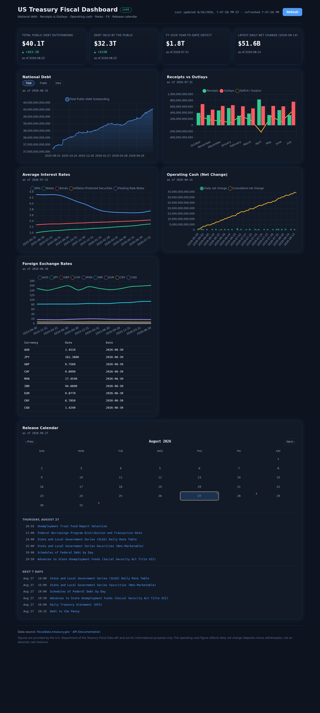

# US Treasury Fiscal Dashboard

A single-file, dark "modern finance" dashboard that live-fetches and visualizes
U.S. Treasury fiscal data from the
[Fiscal Data API](https://fiscaldata.treasury.gov/).

National debt, monthly receipts/outlays/deficit, daily operating cash, average
interest rates, foreign-exchange rates, and an **up-to-date release calendar** —
all in one self-contained `index.html` with inline CSS + JavaScript. No build
step, no server, no account, no API keys.

---

## Features

- **KPI strip** — four headline cards:
  - Total Public Debt Outstanding, with day-over-day delta
  - Debt Held by the Public, with day-over-day delta
  - Fiscal-year-to-date Deficit / Surplus
  - Latest daily operating-cash net change
- **National Debt** — 12-month area chart with a **Total / Public / Intra**
  series toggle.
- **Receipts vs Outlays** — current fiscal year month-by-month grouped bars
  (receipts vs outlays) with a deficit/surplus overlay line.
- **Interest Rates** — average interest rates for Treasury Bills, Notes,
  Bonds, TIPS, and FRNs over the last ~24 months.
- **Operating Cash** — daily **net change** bars (deposits minus withdrawals)
  plus a cumulative net-change line, last ~90 days.
- **FX** — latest-rate table and a multi-line chart for nine major currencies
  (EUR, GBP, JPY, CNY, CAD, CHF, AUD, MXN, INR).
- **Release Calendar** — the official upcoming-release schedule as an
  interactive month grid (release-day dots, clickable days) plus a
  "next 7 days" list. Every release links to its dataset page.
- **Resilient panels** — each panel independently shows a loading skeleton, an
  "as of" timestamp, and an error state with a **Retry** button. A global
  **Refresh** button re-fetches everything.



---

## Quick start

The page fetches data **live from the browser** (the Treasury API is CORS-open,
so no proxy is needed) and needs nothing installed.

```bash
cd /home/david/Documents/us-treasury
python3 -m http.server 8765
```

Then open <http://localhost:8765/index.html>.

You can also open `index.html` directly via `file://`, but serving over HTTP is
more reliable and matches the verification workflow below.

**Refresh:** click **Refresh** in the header (or reload the page). Each panel
has its own Retry button for transient failures.

---

## How it works

### Data flow

1. On `DOMContentLoaded`, `refreshAll()` fires every panel loader in parallel.
2. Each loader (`loadDebt`, `loadMTS`, `loadRates`, `loadCash`, `loadFX`,
   `loadCalendar`) fetches its endpoint with `fetch()` against the Fiscal Data
   API, reshapes the JSON rows, and renders into its panel.
3. Charts are drawn with **Chart.js 4** (loaded from the jsDelivr CDN). A shared
   `makeChart()` factory applies the dark theme (grid lines, tick colors,
   DejaVu Sans) and keeps a `canvasId → chart` registry so re-renders and
   refreshes destroy the previous instance instead of leaking.
4. Panels report their state via a `data-state` attribute
   (`loading` / `ready` / `error`) driven by `setPanelState()`. A retry button
   re-runs that panel's loader (`window.__pendingRetry`), or the full
   `refreshAll()` if no single loader failed.

### Shared helpers (all in `index.html`)

| Helper | Purpose |
| --- | --- |
| `getJSON(path, params)` | Fetch + query-string builder (`filter`, `sort`, `page[size]`, `page[number]`); throws on non-2xx |
| `num(v)` | Coerces API strings to numbers; `"null"`/`""`/non-finite → `null` |
| `fmtCompact(n)` | Compact USD, e.g. `$36.6T`; `null` → `—` |
| `fmtDollars(n)` | Full USD with commas, 0 decimals |
| `setKpi(id, value, delta, label, date)` | Fills a KPI card (sign-aware delta) |
| `setPanelState(panelId, state)` | Toggles a panel's `data-state` + error DOM |
| `makeChart(canvasId, type, data, opts)` | Chart.js factory with dark theme + instance registry |

---

## Data sources

All data comes from the U.S. Treasury Fiscal Data API
(`https://api.fiscaldata.treasury.gov/services/api/fiscal_service`).

| Panel | Dataset | Endpoint | Notes |
| --- | --- | --- | --- |
| National Debt | Debt to the Penny | `v2/accounting/od/debt_to_penny` | Daily |
| Receipts / Outlays / Deficit | Monthly Treasury Statement | `v1/accounting/mts/mts_table_1` | Monthly |
| Interest Rates | Average Interest Rates | `v2/accounting/od/avg_interest_rates` | Monthly |
| Operating Cash | Deposits & Withdrawals of Operating Cash | `v1/accounting/dts/deposits_withdrawals_operating_cash` | Daily |
| FX | Rates of Exchange | `v1/accounting/od/rates_of_exchange` | ~Monthly |
| Release Calendar | Fiscal Service release calendar | `services/calendar/release` | ~4 months ahead |
| Calendar names | Dataset metadata | `services/dtg/metadata/` | Maps datasetId → title/slug |

### API quirks worth knowing

- **Version split.** The Fiscal Data API is migrating from `v1` to `v2`, and
  endpoints are dataset-specific: debt and interest rates live under `v2/`,
  while MTS, DTS, and FX still resolve under `v1/`. The release calendar and
  dataset metadata live under `services/` (not a versioned namespace).
- **Sort direction.** `sort=record_date` returns **oldest first**. The debt
  panel therefore requests `sort=-record_date` (newest first) and reverses, so
  the "latest" row is the last one. Sending plain ascending would return the
  1993 origin of the dataset.
- **FX filter is by country name, not ISO code.** `rates_of_exchange` stores
  currency *names* (`Euro`, `Pound`, `Dinar`), so the FX panel filters
  `country:in:(Euro Zone,United Kingdom,...)` and maps country → ISO code for
  display via the `FX_COUNTRY` table.
- **Calendar metadata fields.** The metadata endpoint returns `dataset_id` and
  `dataset_path` (the kebab-case slug), not `datasetId`/`slug`.
- **Headless browsers are blocked.** The Treasury WAF returns HTTP 500 to the
  default "HeadlessChrome" user agent. Real browsers are unaffected; automated
  checks must spoof a normal UA (see [Verification](#verification)).

### ⚠️ "As of" note — operating cash is **net change**, not a balance

The DTS dataset contains no absolute account-balance rows. Amounts are
denominated in **millions** and represent the daily **net change** (deposits
minus withdrawals). The operating-cash panel therefore plots daily net-change
bars and a cumulative net-change line, and is **never** labeled a cash balance.

---

## Project structure

```
us-treasury/
├── index.html                # The entire app (inline CSS + JS, ~1,150 lines)
├── README.md                 # This file
└── docs/
    ├── README.md             # Short usage reference
    └── superpowers/
        ├── specs/            # Design specification
        └── plans/            # Implementation plan
```

The app is intentionally a **single file** — no build step, no bundler, no
dependencies beyond the Chart.js CDN `<script>` tag. Everything lives in
`index.html`:

- `<style>` — dark theme via CSS custom properties (background `#0d1420`,
  cards `#121a28`, borders `#1e2a3a`; accents blue `#4f9cf7`, green `#2ecc8f`,
  red `#ff5a5f`, gold `#f7b32b`, violet `#a78bfa`), responsive layout
  (grid collapses below 900px), skeleton shimmer, error states, calendar.
- `<body>` — header (title, LIVE badge, last-updated, Refresh), KPI strip, six
  panels, footer with data-source links and disclaimer.
- `<script>` — helpers, panel loaders, Chart.js factory, calendar module,
  refresh/boot wiring, and a `#js-errors` harness used by automated checks.

---

## Verification

Serve the page, dump the rendered DOM with headless Chrome, and assert that all
six panels reach the `ready` state with no JavaScript errors.

> The `--user-agent` argument is **required**: the Fiscal Data API returns HTTP
> 500 to Chrome's default headless UA. `--virtual-time-budget` lets the async
> fetches and Chart.js render before the DOM is dumped.

```bash
cd /home/david/Documents/us-treasury
python3 -m http.server 8765 >/tmp/http.log 2>&1 & echo $! > /tmp/http.pid
google-chrome --headless=new --disable-gpu --no-sandbox --virtual-time-budget=25000 \
  --user-agent="Mozilla/5.0 (X11; Linux x86_64) AppleWebKit/537.36 (KHTML, like Gecko) Chrome/151.0.0.0 Safari/537.36" \
  --dump-dom "http://localhost:8765/index.html" > /tmp/dom.html 2>/tmp/chrome.err
for p in debt mts rates cash fx calendar; do
  grep -q "id=\"panel-$p\" data-state=\"ready\"" /tmp/dom.html && echo "PASS panel-$p ready" || echo "FAIL panel-$p"
done
grep -q 'Last updated' /tmp/dom.html && echo "PASS last-updated"
python3 - <<'EOF'
import re
d=open('/tmp/dom.html').read()
m=re.search(r'id="js-errors"[^>]*>(.*?)</div>', d, re.S)
errs=(m.group(1).strip() if m and m.group(1).strip() else '')
print("JS ERRORS:", errs if errs else 'NONE')
for p in ["panel-debt","panel-mts","panel-rates","panel-cash","panel-fx","panel-calendar"]:
    if 'data-state="error"' in re.search(rf'id="{p}"[^>]*', d).group(0):
        print("ERROR STATE:", p)
EOF
kill $(cat /tmp/http.pid) 2>/dev/null
```

**Expected output:** six `PASS panel-* ready` lines, `PASS last-updated`,
`JS ERRORS: NONE`, and no `ERROR STATE` lines.

---

## Privacy & security

- **No tracking, no telemetry.** The page makes direct `fetch()` calls to the
  Treasury API from your browser and renders locally. Nothing is sent anywhere
  except the standard GET requests to `api.fiscaldata.treasury.gov` and the
  Chart.js CDN.
- **No secrets.** There are no API keys, tokens, or credentials anywhere in the
  app.
- **Safe DOM rendering.** Panel content is built with `textContent` /
  `createElement` (never `innerHTML` with untrusted data), and external links
  use `rel="noopener"`.

---

## Troubleshooting

| Symptom | Likely cause / fix |
| --- | --- |
| A panel shows "Unable to load — Retry" | The Treasury API was temporarily unreachable or rate-limited. Click **Retry**; if it persists, the panel degrades independently — the rest of the dashboard keeps working. |
| The page renders nothing / blank panels | The browser blocked the Chart.js CDN (offline/network policy). Charts need internet access to `cdn.jsdelivr.net`. |
| Everything errors in headless automation | You're hitting the WAF headless-UA block — add the `--user-agent` spoof from [Verification](#verification). |
| Calendar looks empty | The calendar data covers ~4 months ahead from the live API; if no releases fall in the currently viewed month, the grid shows no dots. Navigate with the ‹ › buttons. |

---

## Development notes

- **Design specification:** [`docs/superpowers/specs/2026-08-27-us-treasury-dashboard-design.md`](docs/superpowers/specs/2026-08-27-us-treasury-dashboard-design.md)
- **Implementation plan:** [`docs/superpowers/plans/2026-08-27-us-treasury-dashboard.md`](docs/superpowers/plans/2026-08-27-us-treasury-dashboard.md)
- **API documentation:** <https://fiscaldata.treasury.gov/api-documentation/>
- **Dataset search:** <https://fiscaldata.treasury.gov/datasets/>
- **Release calendar:** <https://fiscaldata.treasury.gov/release-calendar/>

---

## License

Not licensed — this is a personal dashboard. Data remains the property of the
U.S. Department of the Treasury (see the [Fiscal Data terms of use](https://fiscaldata.treasury.gov/)).